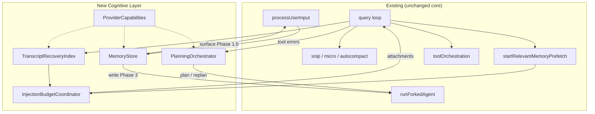

# Agent Cognitive Layer Design

**Date:** 2026-06-25  
**Revision:** 2 (post review)  
**Status:** Approved — Phase 1 plan written  
**Approach:** Phased Cognitive Stack (Option C)

## Summary

Add a **Cognitive Layer** on top of the existing `query()` loop to improve context recovery after compaction, structured planning with replan, and cross-session memory—without rewriting `REPL.tsx` or `query.ts`. The layer integrates via the same prefetch/consume pattern used by `startRelevantMemoryPrefetch` and routes sidecar work through `runForkedAgent`.

**Revision 2 changes (from review):**

- Phase 1 reframed as **Transcript Recovery Index** — does **not** duplicate existing memory prefetch.
- Acceptance criteria split by phase; full 50-turn semantic recall deferred to Phase 3.1.
- Added **PlanningOrchestrator step lifecycle**, failure classification, and replan injection rules.
- **Scope gate:** Phase 1–2 main thread only (`repl_main_thread`, no `agentId`).
- **Phase 1.5:** read-only `MemoryStore.surfaceOnSessionStart()` for early cross-session validation.
- Added **InjectionBudgetCoordinator** to prevent token budget stacking.
- Testing prioritizes unit tests + headless paths; REPL smoke is secondary.

**Success criteria (program-level):**

1. **Long sessions (50+ turns):** Key in-session decisions remain accessible after compaction (full semantic recall: Phase 3.1).
2. **Multi-step tasks:** Approved plans decompose, execute, and replan on repeated recoverable failure.
3. **Cross-session continuity:** Reopening a project surfaces prior preferences and architectural decisions.

**Runtime constraint:** Must work on both Anthropic API and third-party proxy paths (e.g. `deepseek-proxy` via `isCustomApiProxyMode()`).

---

## Goals

| Priority | Capability | Module |
|----------|------------|--------|
| P0 | Transcript / compact-boundary recovery injection | `TranscriptRecoveryIndex` (via `ContextProvider`) |
| P0 | Plan → execute → verify → replan loop | `PlanningOrchestrator` |
| P1 | Cross-session surfacing (read path early) | `MemoryStore.surfaceOnSessionStart` (Phase 1.5) |
| P1 | Unified memory write / recall | `MemoryStore` (Phase 3) |
| P1 | Failure → replan bridge | `PlanningOrchestrator` + `toolExecution` hook |
| P2 | Provider-agnostic feature degradation | `ProviderCapabilities` |
| P2 | Semantic retrieval (embedding) | Phase 3.1 |

## Non-Goals

- Rewriting `query.ts` or `REPL.tsx` core logic
- Indexing or injecting from `memory/` in Phase 1 (already handled by `startRelevantMemoryPrefetch` / `findRelevantMemories`)
- External embedding services or vector DB in Phase 1
- Swarm / Teammate / Coordinator / subagent cognitive features in Phase 1–2
- Replacing the existing autocompact pipeline (complements it)
- Replacing the Task tool system (Orchestrator mirrors it, does not own it)

## Boundary with Existing Code

| Concern | Existing owner | Cognitive Layer |
|---------|----------------|-----------------|
| Project / auto-memory file surfacing | `startRelevantMemoryPrefetch`, `getRelevantMemoryAttachments` | **Do not duplicate** |
| Session transcript compaction | snip / microcompact / autocompact | **Complement** via post-compact re-index |
| In-session decisions lost after compact | *(gap)* | **Phase 1 primary target** |
| Plan markdown | `plans.ts`, Enter/ExitPlanMode | **Phase 2** adds `plan.json` sidecar |
| Durable memory write | `extractMemories`, `sessionMemory` | **Phase 3** unified via `MemoryStore.write` |

---

## Architecture

### Placement

The Cognitive Layer sits **outside** the query loop as turn-scoped services:

```
processUserInput → MemoryStore.surface (Phase 1.5) → query loop
  query turn:
    TranscriptRecoveryIndex.prefetch → compact pipeline → API → tools
    → InjectionBudgetCoordinator → memory prefetch consume → recovery consume
    → PlanningOrchestrator.onToolResults (Phase 2)
  turn end:
    handleStopHooks → MemoryStore.write (Phase 3)
```

Existing components preserved: snip, microcompact, autocompact, `toolOrchestration`, `runForkedAgent`, `startRelevantMemoryPrefetch`.

### Scope Gate (Phase 1–2)

Cognitive features activate **only when all** of:

- `CLAUDE_CODE_COGNITIVE_LAYER=1` and phase-specific flag enabled
- `querySource` is `repl_main_thread` (or equivalent main-thread headless source)
- `toolUseContext.agentId` is **undefined** (not a subagent / sidechain)

Subagent and Swarm paths are explicitly out of scope until a future phase.

### Integration Anchors

| Module | Mount point | Existing code |
|--------|-------------|---------------|
| `TranscriptRecoveryIndex` | `query.ts` turn entry, parallel to memory prefetch | `query.ts` consume block ~1599 |
| `InjectionBudgetCoordinator` | Before any cognitive attachment yield | `RELEVANT_MEMORIES_CONFIG`, `tokenCountWithEstimation` |
| `PlanningOrchestrator` | Plan Mode + post-tool hook | `plans.ts`, Enter/ExitPlanMode, `Task*Tool` |
| `MemoryStore` | Session start (1.5 read) + turn end (3 write) | `extractMemories.ts`, `sessionMemory.ts`, `claudemd.ts` |
| Fork execution | Replan + memory write sidecars | `forkedAgent.ts` |

### Diagram



---

## Core Interfaces

New file: `src/cognitive/types.ts`

```typescript
/** Phase 1: transcript, tool_result, plan snippets only — NOT memory/ */
type RecoverySliceSource = 'transcript' | 'tool_result' | 'plan_snippet' | 'compact_summary'

interface RecoverySlice {
  source: RecoverySliceSource
  content: string
  relevanceScore: number
  tokenEstimate: number
  compactBoundaryId?: string  // ties slice to pre-compact region
}

interface TranscriptRecoveryIndex {
  prefetch(messages: Message[], ctx: ToolUseContext): RecoveryPrefetch | undefined
  consume(): Promise<RecoverySlice[]>
  toAttachments(slices: RecoverySlice[]): AttachmentMessage[]
  onCompactBoundary(boundaryMessage: Message): void  // re-index trigger
}

interface InjectionBudgetCoordinator {
  /** Remaining bytes/tokens for cognitive attachments this turn */
  remainingBudget(ctx: ToolUseContext): number
  /** Returns slices that fit within shared budget with memory prefetch */
  allocate(slices: RecoverySlice[], memoryBytesAlreadyUsed: number): RecoverySlice[]
}

interface PlanStep {
  id: string
  description: string
  dependsOn?: string[]
  status: 'pending' | 'running' | 'done' | 'failed' | 'skipped'
  retryCount: number
  /** Optional link to Task tool id when mirrored */
  taskId?: string
  /** Tool names expected for this step (hint, not enforced) */
  expectedTools?: string[]
}

interface Plan {
  id: string
  steps: PlanStep[]
  status: 'draft' | 'approved' | 'executing' | 'failed' | 'done'
  activeStepId?: string
}

interface PlanningOrchestrator {
  isActive(ctx: ToolUseContext): boolean
  onPlanApproved(plan: Plan): void
  onToolResult(toolName: string, toolUseId: string, isError: boolean, errorKind: ToolErrorKind): void
  onTaskCreated(taskId: string, subject: string): void  // mirror hook
  requestReplan(reason: string): AsyncGenerator<Message>
}

type ToolErrorKind = 'recoverable' | 'permission_denied' | 'aborted' | 'validation'

interface MemoryEntry {
  id: string
  scope: 'session' | 'project' | 'user'
  tags: string[]
  content: string
  createdAt: number
}

interface MemoryStore {
  recall(query: string, scope: MemoryScope): Promise<MemoryEntry[]>
  write(entry: Omit<MemoryEntry, 'id' | 'createdAt'>): Promise<void>  // Phase 3
  surfaceOnSessionStart(): Promise<AttachmentMessage[]>  // Phase 1.5 read-only
}

interface ProviderCapabilities {
  supportsPromptCache: boolean
  supportsThinking: boolean
  supportsEffort: boolean
  maxContextWindow: number
  preferredSummarizerModel: string
}
```

Interfaces defined in Phase 1; extended in later phases without breaking consumers.

---

## PlanningOrchestrator — Step Lifecycle (Phase 2)

### Activation

Orchestrator is **active** only when:

1. Scope gate passes (main thread)
2. `~/.claude/plans/<slug>.plan.json` exists with `status: 'executing'`
3. Plan was approved via ExitPlanMode (or `/plan` + explicit user approval recorded in `plan.json`)

If the model never creates `plan.json` or stays in freeform Task usage, Orchestrator remains **passive** (no replan, no step tracking).

### Step Source Priority

When building or syncing steps:

1. **Primary:** `plan.json` steps written at plan approval (parsed from plan md or explicit step list)
2. **Mirror:** `TaskCreateTool` → append/update step with `taskId` link (best-effort)
3. **Fallback:** Parse numbered list from `plans/<slug>.md` (fragile; log warning)

### Active Step Tracking

- On plan approval: first step with no unmet `dependsOn` → `activeStepId`
- On tool success while active: if tool matches `expectedTools` or any tool in executing phase, mark step `done`, advance
- On turn complete with no errors: heuristic advance only if single pending step (avoid false positives)

### Failure Classification

| `ToolErrorKind` | Count toward replan? |
|-----------------|----------------------|
| `recoverable` (`is_error: true`, not permission) | Yes |
| `permission_denied` | No — user must approve |
| `aborted` | No |
| `validation` (schema/input) | Yes, after 2nd occurrence on same step |

### Replan Trigger

- Same step: **3** consecutive `recoverable` errors
- User: `/replan` command
- Model: optional `RequestReplan` tool (Phase 2.1)

### Replan Execution

1. `runForkedAgent` with: current `plan.json`, failure log (last 3 errors), plan md excerpt
2. Output: revised steps + updated md section
3. **Injection:** revised plan delivered as **`plan_updated` attachment** (visible in transcript) **plus** a synthetic user-context block:

   ```
   [Plan revised after step failure] Step 5 failed 3 times. Follow the updated plan in the attachment.
   ```

   Hidden-only attachments are insufficient — the model must see replan as first-class context.

4. Circuit breaker: max **2** auto-replans per step per session; then surface "Needs your guidance"

### Task Mirror Consistency

- `TaskCreateTool` hook calls `onTaskCreated` → append step if no matching subject in `plan.json`
- `TaskUpdateTool` status changes sync to step status when `taskId` linked
- **Desync is acceptable**; Orchestrator never blocks Task tools. Telemetry event `cognitive_plan_task_desync` for monitoring.

---

## Phased Delivery

### Phase 1 — Transcript Recovery Index (P0, ~2–3 weeks)

**Problem:** Autocompact removes in-session decisions from the API-visible transcript. Existing memory prefetch covers **files on disk**, not **conversation content**.

**Scope:**

- New `src/cognitive/context/`:
  - `TranscriptRecoveryIndex.ts` — implements prefetch/consume
  - `localIndex.ts` — indexes transcript user/assistant text, tool result excerpts, plan snippet refs
  - `relevanceScore.ts` — keyword + recency + compact-boundary proximity (no embedding)
- **Exclude:** `memory/` directory, `getRelevantMemoryAttachments` paths
- Hook into `query.ts` parallel to `pendingMemoryPrefetch`
- `onCompactBoundary()` called when autocompact yields compact boundary message — snapshot pre-compact index region into `compact_summary` slices
- `InjectionBudgetCoordinator`: shared ceiling with memory prefetch (see below)
- `ProviderCapabilities` stub for proxy vs Anthropic
- Scope gate enforced

**Injection budget (shared):**

```
MAX_COGNITIVE_INJECTION_BYTES = min(5% context window in tokens, 40_000 bytes)
  minus bytes already consumed by relevant_memories this session (scan messages, same as existing)
  minus other cognitive attachments this turn
```

Default cap aligns with existing `RELEVANT_MEMORIES_CONFIG.MAX_SESSION_BYTES` (60KB session) — recovery index uses **at most half** (~30KB) when memory prefetch is active, full budget when memory prefetch returns nothing.

**Phase 1 acceptance (T1a, T-pipe, T5):**

| ID | Scenario | Pass criteria |
|----|----------|---------------|
| T1a | Fixture transcript with compact boundary at turn 30 | Pre-compact decision appears in recovery attachment at turn 31+ |
| T-pipe | Unit tests | prefetch → consume → toAttachments → budget truncation all pass |
| T5 | `CLAUDE_CODE_COGNITIVE_LAYER=0` | Identical to current behavior |

**Not Phase 1 acceptance:** 50-turn live session with keyword-only recall (moved to T1b / Phase 3.1).

### Phase 1.5 — Memory Surfacing Read Path (P1, ~1 week)

**Scope:**

- `MemoryStore.ts` with **read-only** methods: `recall`, `surfaceOnSessionStart`
- Reads existing `memory/`, CLAUDE.md excerpts, session memory file — **no write path yet**
- Hook: `processUserInput` first turn → inject top-5 entries (keyword rank v1)
- Does not replace `startRelevantMemoryPrefetch`; session-start surfacing is **one-shot at open**, prefetch remains **per-turn**

**Acceptance (T3-partial):**

| ID | Scenario | Pass criteria |
|----|----------|---------------|
| T3a | Session B after Session A wrote memory file | B's first turn attachment includes A's recorded preference (fixture-based unit test + manual) |

### Phase 2 — Planning Orchestrator (P0, ~3–4 weeks)

**Scope:** As defined in Step Lifecycle section above, plus:

- `src/cognitive/planning/planState.ts` — `plan.json` read/write
- Replan hook in `toolExecution.ts` (~20 lines, calls orchestrator with `ToolErrorKind`)
- `/replan` slash command
- Scope gate enforced

**Acceptance (T2):**

| ID | Scenario | Pass criteria |
|----|----------|---------------|
| T2 | Fixture plan.json executing, step 5 fails 3× recoverable | `plan_updated` attachment + synthetic context; step 5 revised; step 6 reachable in fixture simulation |

Manual: 10-step refactor with forced failures (when REPL bootable).

### Phase 3 — Memory Write Unification (P1, ~2–3 weeks)

**Scope:**

- `MemoryStore.write()` facade over `extractMemories` + `sessionMemory` (when `feature('EXTRACT_MEMORIES')` / session memory gates allow)
- Tag-based dedup merge on write
- Route `stopHooks.ts` through MemoryStore
- Restored build fallback: if extractMemories feature off, write path no-ops with debug log

**Acceptance (T3):**

| ID | Scenario | Pass criteria |
|----|----------|---------------|
| T3 | Full cross-session write + surface | Same as T3a plus write dedup verified in unit tests |

### Phase 3.1 — Semantic Retrieval (P2, optional)

- Local embedding index for `TranscriptRecoveryIndex` + `MemoryStore.recall`
- Feature flag: `CLAUDE_CODE_COGNITIVE_EMBEDDING=1`
- **T1b acceptance:** 50-turn session, 5 fixture scenarios, ≥80% keyword-independent recall of seeded decisions

---

## Data Flow

### Session Start (Phase 1.5+)

1. `processUserInput` (first query) calls `MemoryStore.surfaceOnSessionStart()`
2. `InjectionBudgetCoordinator` allocates budget for session-start attachments
3. Top-K entries injected before first API call

### Each Query Turn

```
turn start [scope gate check — skip entire cognitive block if subagent]
  ├─ transcriptRecovery.prefetch()       // parallel with pendingMemoryPrefetch
  ├─ applyToolResultBudget → snip → microcompact → autocompact
  │     └─ on compact boundary → transcriptRecovery.onCompactBoundary()
  ├─ API streaming
  ├─ runTools()
  ├─ getAttachmentMessages()
  ├─ pendingMemoryPrefetch.consume()      // existing — memory FILES
  ├─ transcriptRecovery.consume()         // NEW — transcript TOOL/plan slices
  ├─ injectionBudget.allocate()           // merge + truncate both sources
  ├─ yield combined attachments
  ├─ planningOrchestrator.onToolResults() // Phase 2
  └─ continue or terminal
```

**Recovery consume rules** (same as memory prefetch):

- Zero-wait if not settled; retry next iteration
- Filter content already in `readFileState` or duplicate attachment text
- Never inject same `compactBoundaryId` slice twice post-compact

### Turn End

- Phase 2: `planningOrchestrator.onTurnComplete()`
- Phase 3: `MemoryStore.write()` via stopHooks (replaces direct extractMemories/sessionMemory calls when gates allow)

### Replan Path

See **PlanningOrchestrator — Step Lifecycle**.

---

## Error Handling

| Scenario | Strategy | User-visible |
|----------|----------|--------------|
| Recovery prefetch timeout (2s) | Skip injection | None |
| Index corrupt | Log + `[]` | None |
| Shared budget exhausted | Truncate recovery first, then memory | None |
| Replan fork fails | Keep plan; suggest `/replan` | Short hint |
| 2 auto-replans exhausted | Stop; set step `failed` | "Needs your guidance" |
| Memory write feature off (restored) | Skip write; surface read still works | None |
| Proxy without cache/thinking | `ProviderCapabilities` | Same logic, higher cost |
| Cognitive total off | `CLAUDE_CODE_COGNITIVE_LAYER=0` | Current behavior |

**Circuit breakers:** replan 2/step; memory write 1 fork/turn; recovery index 50MB/session LRU.

---

## State Storage

| State | Location | Format |
|-------|----------|--------|
| Plan content | `~/.claude/plans/<slug>.md` | Markdown |
| Plan machine state | `~/.claude/plans/<slug>.plan.json` | JSON sidecar |
| Recovery index | `~/.claude/projects/<path>/cognitive/recovery-index.json` | JSON |
| Memory entries | Existing `memory/` directory | Markdown via MemoryStore |
| Provider caps | Runtime | In-memory |

---

## Feature Flags

**Phase 1 rollout (env vars — dev friendly):**

```bash
CLAUDE_CODE_COGNITIVE_LAYER=1
CLAUDE_CODE_COGNITIVE_CONTEXT=1      # TranscriptRecoveryIndex
CLAUDE_CODE_COGNITIVE_MEMORY_SURFACE=1  # Phase 1.5 read path
CLAUDE_CODE_COGNITIVE_PLANNING=1    # Phase 2
CLAUDE_CODE_COGNITIVE_MEMORY_WRITE=1 # Phase 3 write path
CLAUDE_CODE_COGNITIVE_EMBEDDING=1   # Phase 3.1
```

**Long-term:** align with `bun:bundle feature('COGNITIVE_*')` and/or `settings.json` when restored tree supports bundle flags. Until then, env vars are authoritative. Document restored-build behavior when `feature('EXTRACT_MEMORIES')` is false.

---

## File Structure

```
src/cognitive/
├── types.ts
├── ProviderCapabilities.ts
├── InjectionBudgetCoordinator.ts
├── context/
│   ├── TranscriptRecoveryIndex.ts
│   ├── localIndex.ts
│   └── relevanceScore.ts
├── planning/
│   ├── PlanningOrchestrator.ts
│   ├── planState.ts
│   ├── stepLifecycle.ts
│   └── replanPrompt.ts
├── memory/
│   ├── MemoryStore.ts
│   └── deduplicate.ts
└── __tests__/
    ├── TranscriptRecoveryIndex.test.ts
    ├── InjectionBudgetCoordinator.test.ts
    ├── PlanningOrchestrator.test.ts
    ├── MemoryStore.test.ts
    └── fixtures/
        ├── compact-boundary-transcript.json
        └── plan-executing-step5-fail.json
```

**Existing file changes:**

| File | Phase | Change |
|------|-------|--------|
| `src/query.ts` | 1 | recovery prefetch/consume + compact boundary hook (~40 lines) |
| `src/utils/processUserInput/processUserInput.ts` | 1.5 | session-start surfacing (~15 lines) |
| `src/services/tools/toolExecution.ts` | 2 | orchestrator hook with error kind (~20 lines) |
| `src/query/stopHooks.ts` | 3 | MemoryStore.write routing |
| `src/commands/plan/` or new `src/commands/replan/` | 2 | `/replan` command |

---

## Testing Strategy

### Priority

1. **Unit tests** in `src/cognitive/__tests__/` — primary gate; no REPL required
2. **Headless QueryEngine** path — integration when `dev-entry` blocked
3. **REPL manual smoke** — when restored tree boots

Restored tree note: `dev-entry.ts` may block `bun run dev`. Phase 1–2 validation must not depend on full CLI boot.

### Scenarios by Phase

| ID | Phase | Scenario | Pass criteria |
|----|-------|----------|---------------|
| T1a | 1 | Compact boundary fixture | Pre-compact decision in recovery attachment |
| T-pipe | 1 | Pipeline unit tests | All green |
| T3a | 1.5 | Session B surfaces A's memory | First-turn attachment |
| T2 | 2 | Plan step 5 triple failure | Replan attachment + revised steps |
| T3 | 3 | Write + surface round-trip | Dedup + recall |
| T1b | 3.1 | 50-turn semantic recall | ≥80% on fixtures |
| T4 | 1+ | Proxy path T1a/T-pipe | Same as Anthropic |
| T5 | all | Master flag off | No regression |

### Manual Smoke (when bootable)

```powershell
bun test src/cognitive/__tests__
bun run dev  # if dev-entry passes
```

---

## Provider Dual-Path Strategy

Anthropic: full capabilities. Proxy (`isCustomApiProxyMode()`): cache/thinking/effort false. Cognitive logic unchanged; fork agents work without cache hits.

---

## Risks and Mitigations

| Risk | Mitigation |
|------|------------|
| Duplicates memory prefetch | Phase 1 explicitly excludes `memory/` |
| T1 unrealistic for keyword-only | T1a/T-pipe in Phase 1; T1b in 3.1 |
| Plan/Task desync | Passive mirror + telemetry; replan uses plan.json primary |
| Token budget stacking | InjectionBudgetCoordinator |
| Subagent state pollution | Scope gate Phase 1–2 |
| dev-entry blocks REPL | Unit tests + headless first |
| EXTRACT_MEMORIES off in restored | Write no-op; read path still works |
| Replan invisible to model | Visible attachment + synthetic user-context block |

---

## Revision History

| Version | Date | Changes |
|---------|------|---------|
| 1 | 2026-06-25 | Initial draft |
| 2 | 2026-06-25 | Review revisions: Phase 1 reframe, step lifecycle, budgets, acceptance split, Phase 1.5 |

---

## Next Step

After spec approval: invoke **writing-plans** skill for Phase 1 implementation plan (`TranscriptRecoveryIndex` + `InjectionBudgetCoordinator`).
